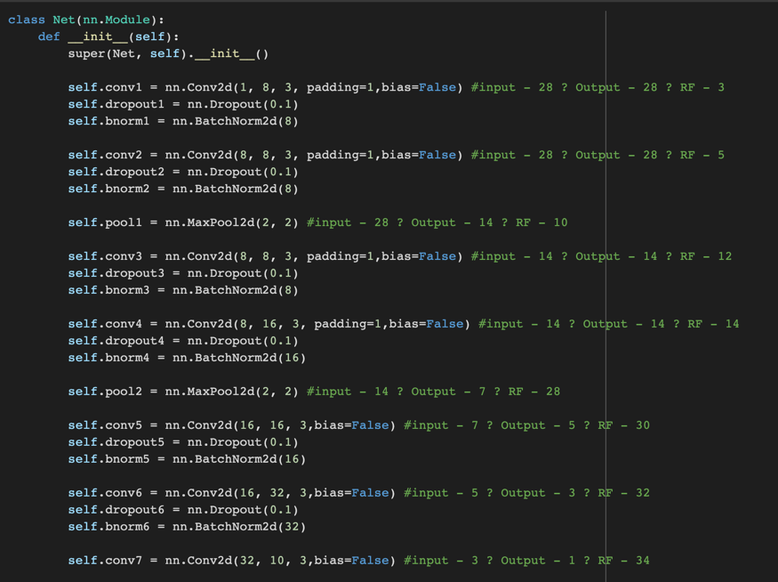
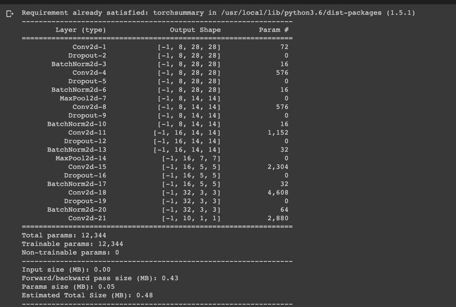
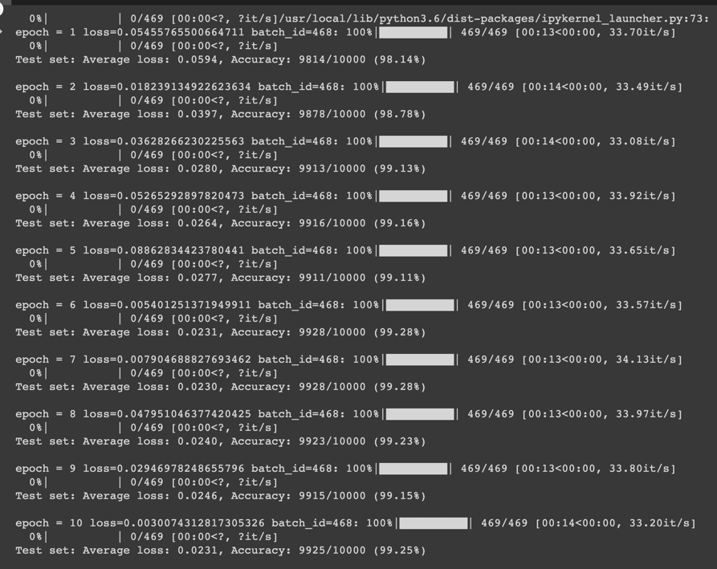
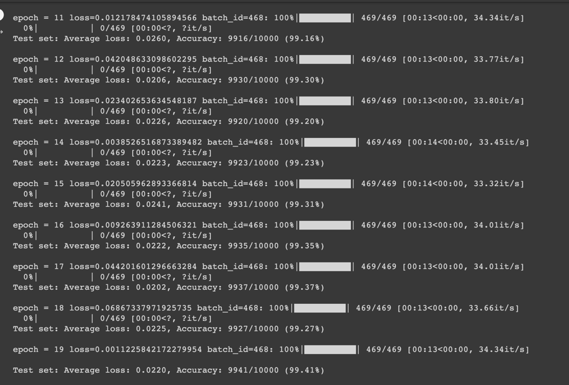

# Session 4 [Assignment](Session_4_Assignment.ipynb)

### Constraints:
- Achieve 99.4% validation accuracy
- Less than 20k Parameters
- Less than 20 Epochs
- No fully connected layer

## Network

- Network Params

  
## Epochs 1-10

## Epochs 11-19

## Conclusion
- At epoch 19 we observe a 99.41% accuracy.

