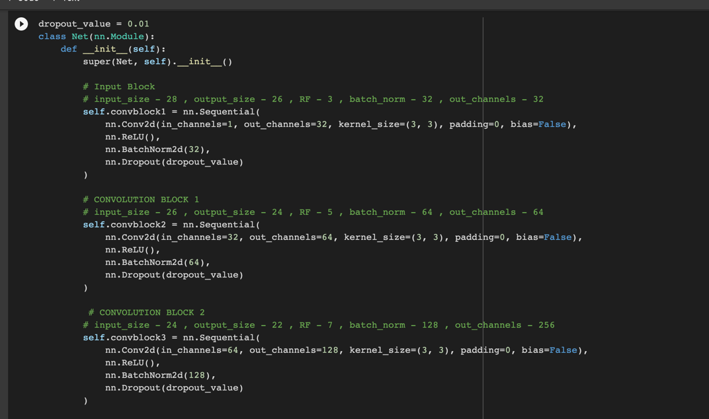
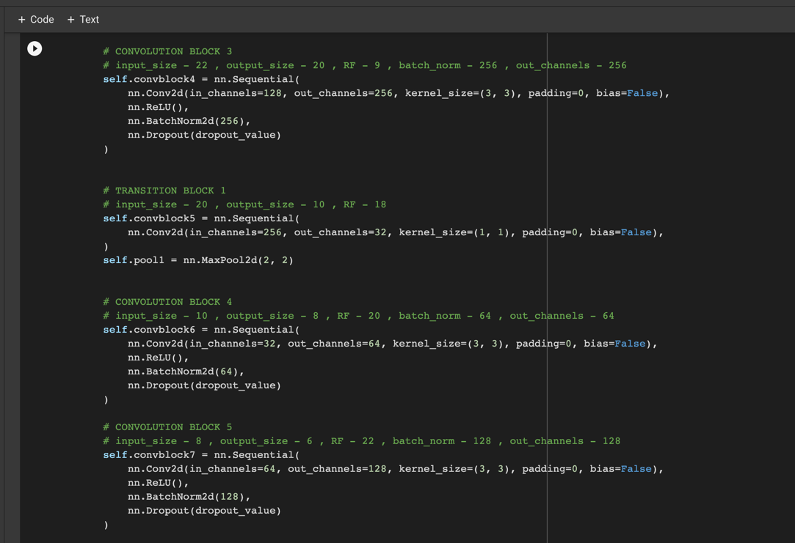
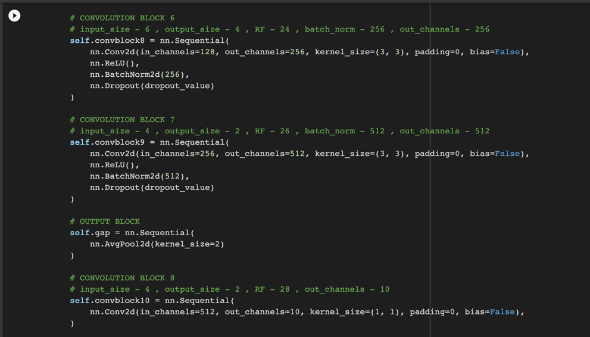
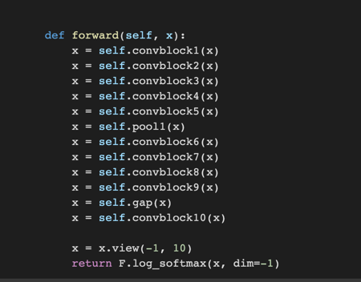
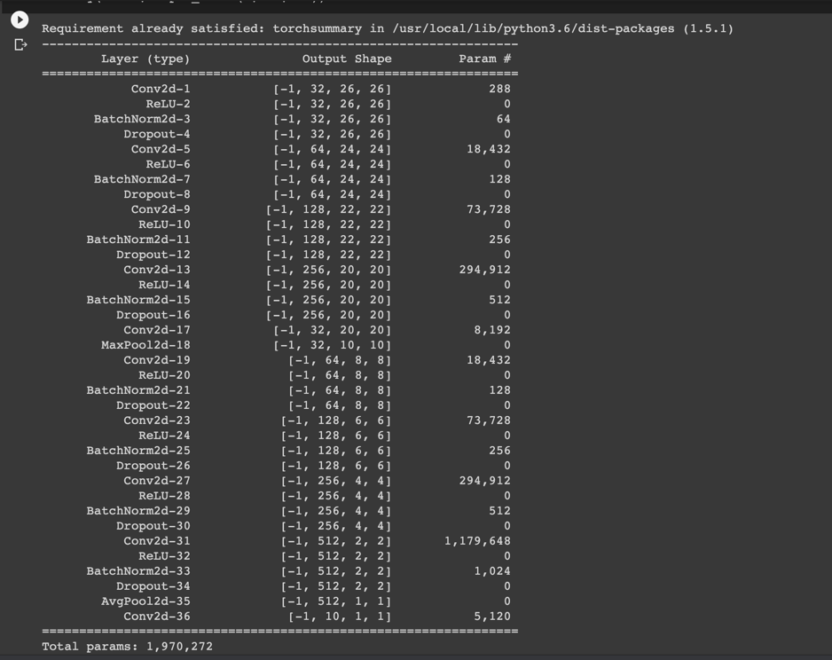
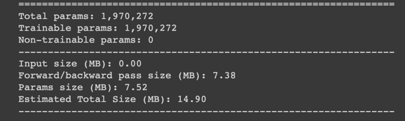
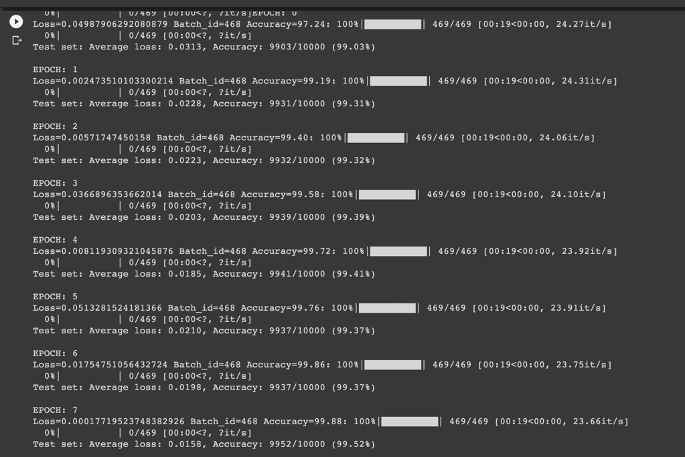
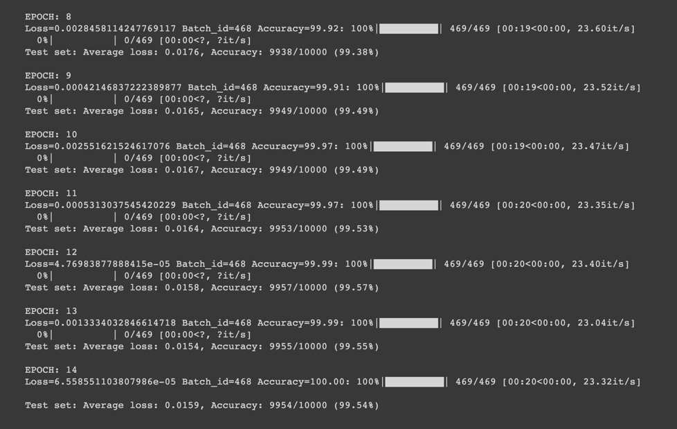

# Session 5 Assignment - Step 1

## Network

- Network Params

  
  
## Epochs 1-8

## Epochs 8-15

## Target:

1.   Set up a working model with Gap , 1x1 convolution , dropout & batch norm

## Results:

1.   Parameters: 1,970,272
2.   Best Training Accuracy: 100%
3.   Best Test Accuracy: 99.57%

## Conclusion 

*   Model is over-fitting
*   Less than 10k params used.
*   Max testing accuracy achieved and can never increase since 100% accuracy achieved in training.
*   Model has too many params.