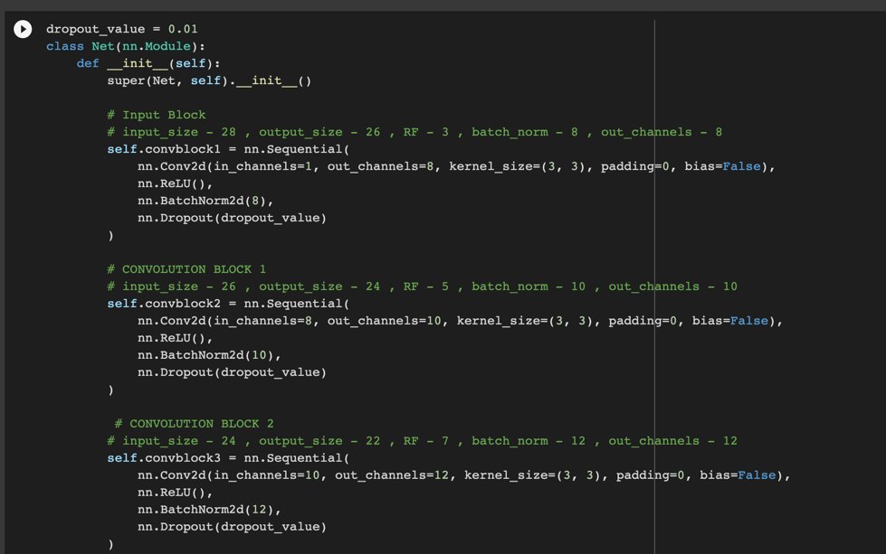
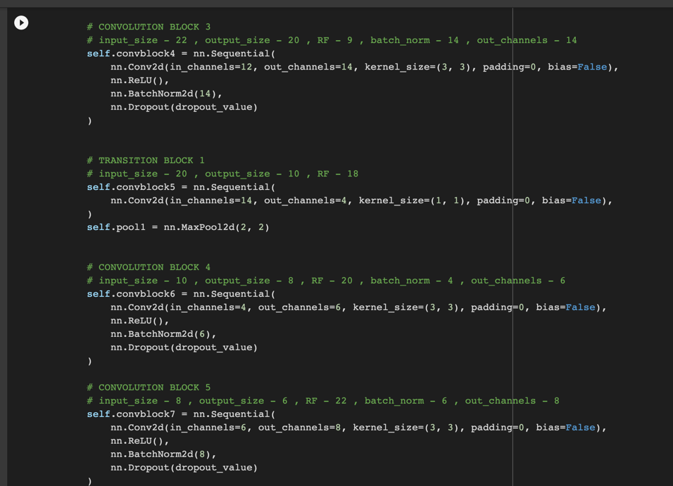
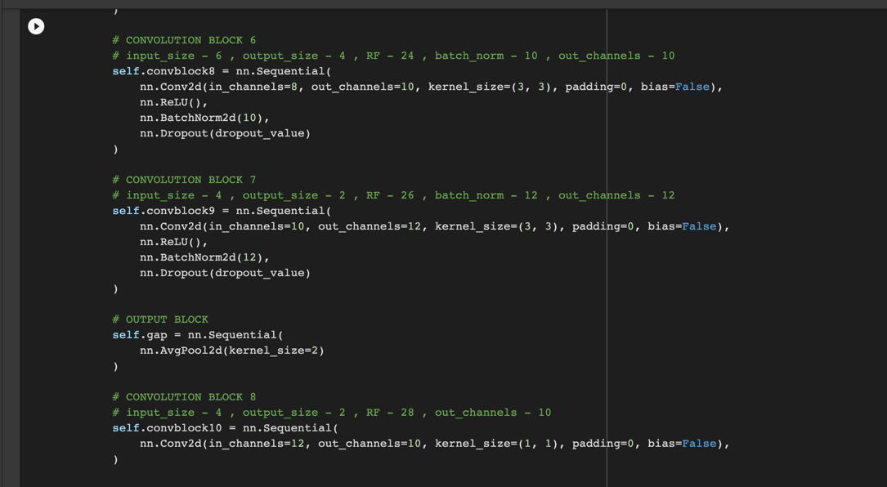
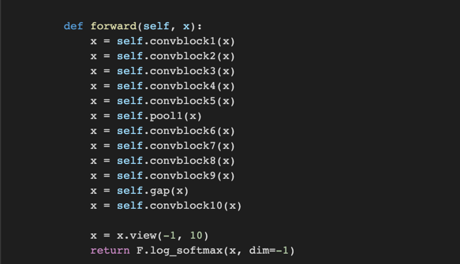
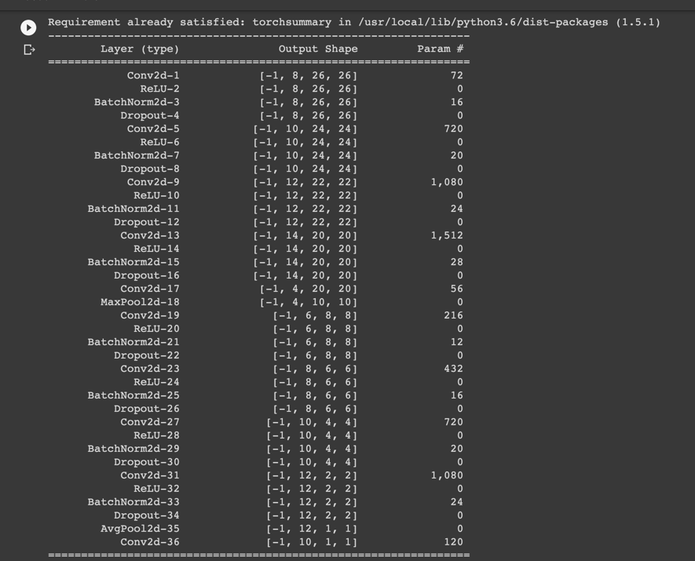
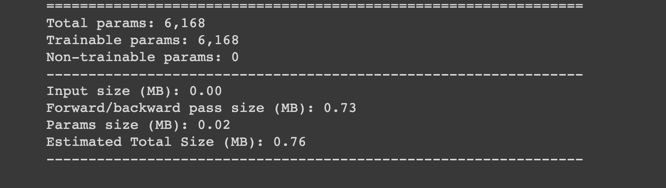
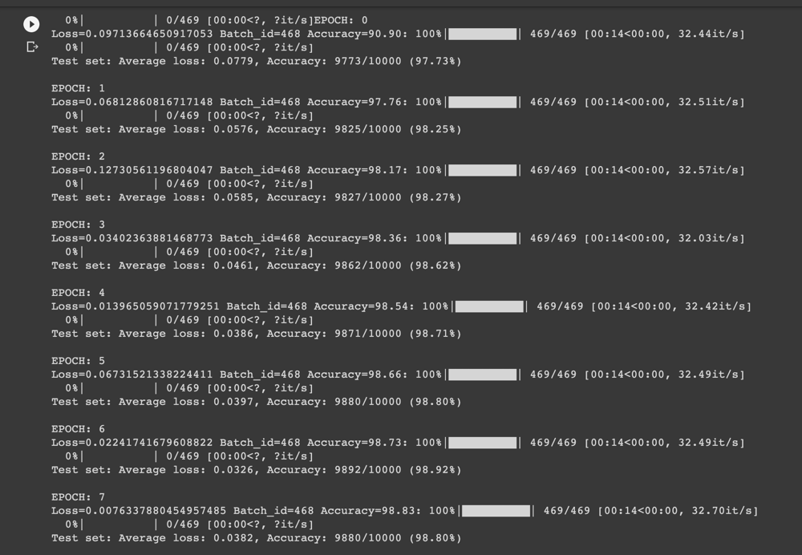
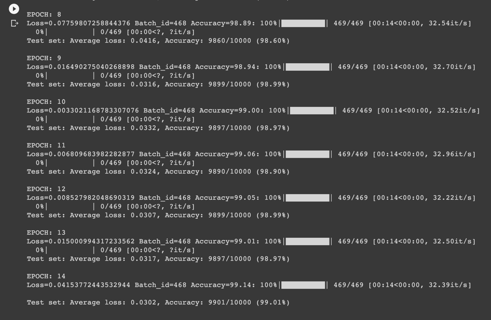

# Session 5 Assignment - [Step 2](Session_5_Assignment_step_2.ipynb)

## Network

- Network Params

  

  
## Epochs 1-8

## Epochs 9-15

## Target:

1.   Lower params < 10,000

## Results:

1.   Parameters: 6,168
2.   Best Training Accuracy: 99.05%
3.   Best Test Accuracy: 99.01%

## Conclusion 

*   Model is under-fitting
*   Less than 10k params used.