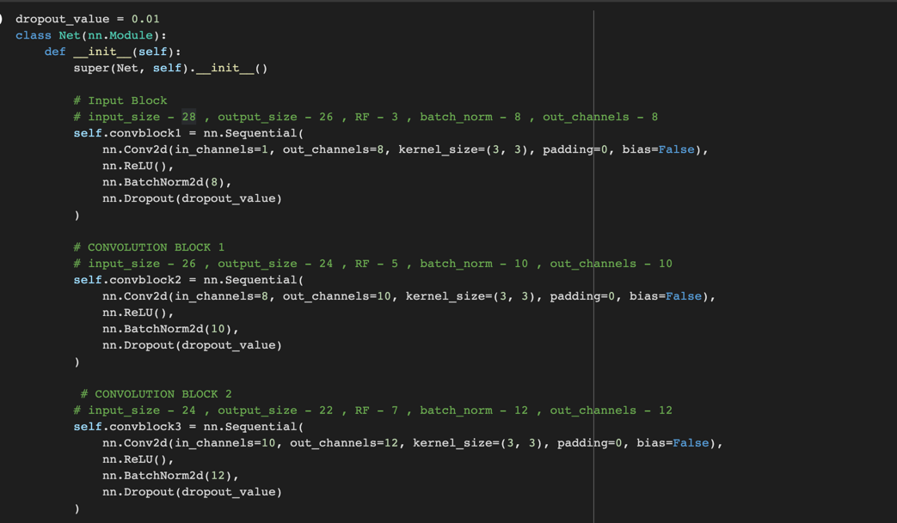
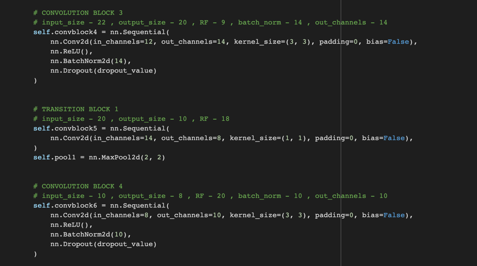
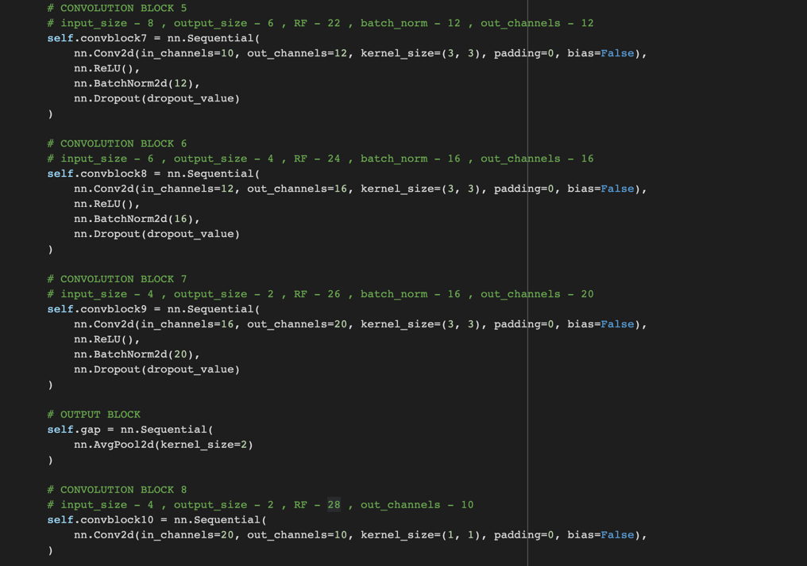
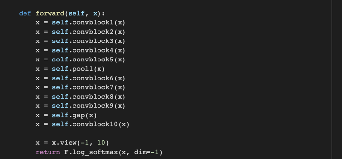
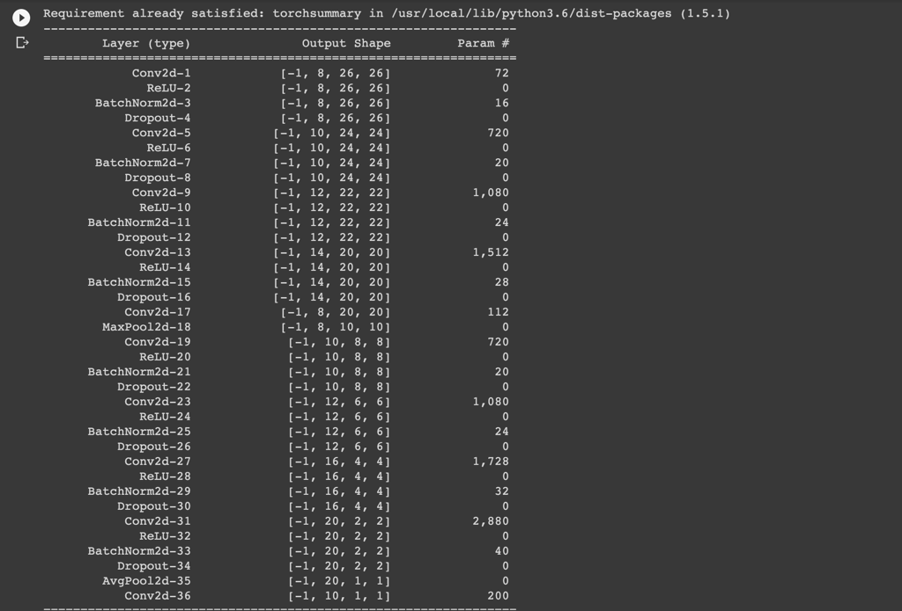
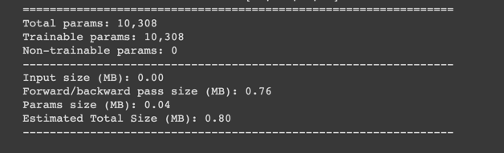
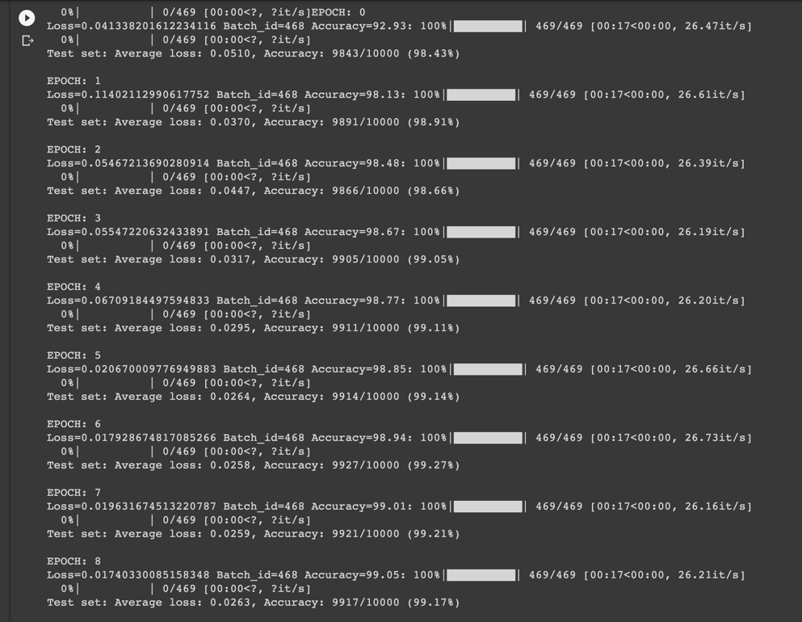
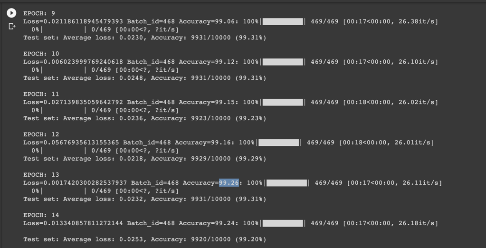

# Session 5 Assignment - [Step 3](Session_5_Assignment_step_3.ipynb)

## Network

- Network Params

  
## Epochs 1-9

## Epochs 11-15

## Target:

1.   Addition of Image Augmentation (Random Rotation).
2.   Addition of GAP (Global Average Pooling) layer to the network.

## Results:

1.   Parameters: 10,308
2.   Best Training Accuracy: 99.26%
3.   Best Test Accuracy: 99.31%

## Conclusion 

*   Model is over-fitting