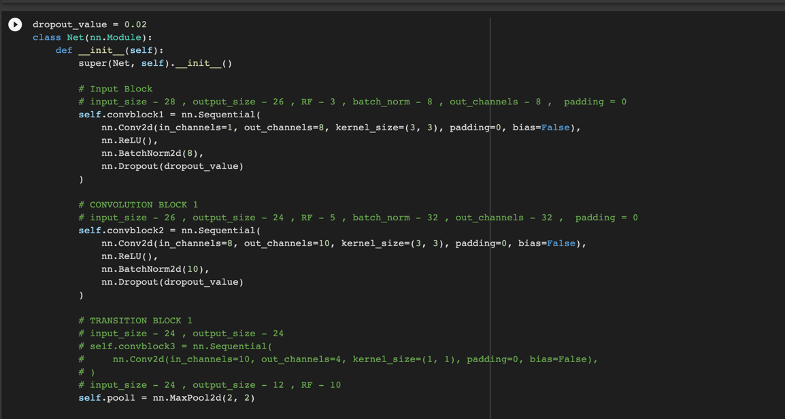
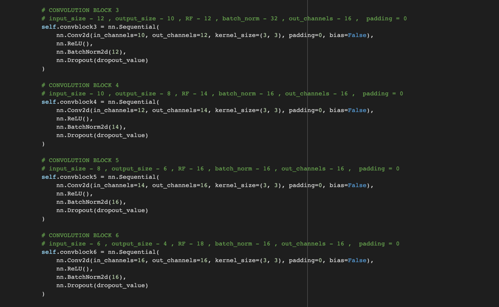
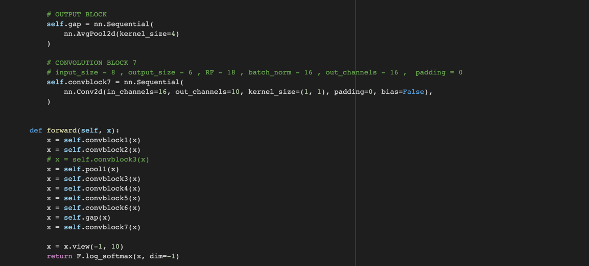
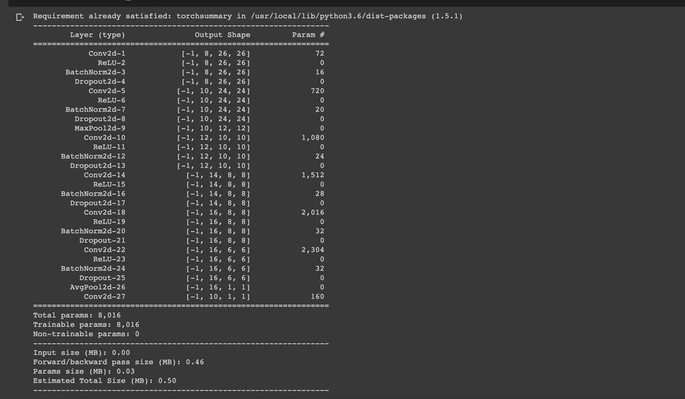
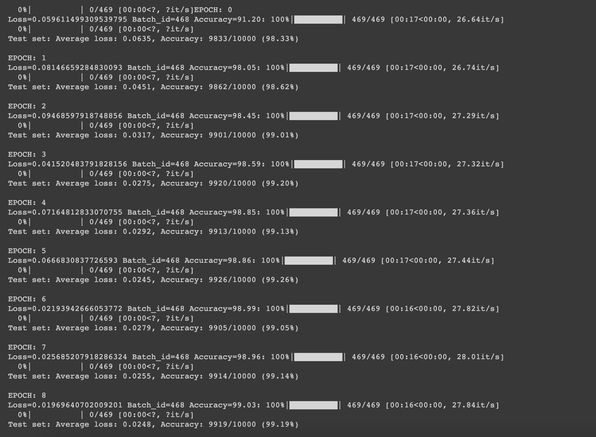
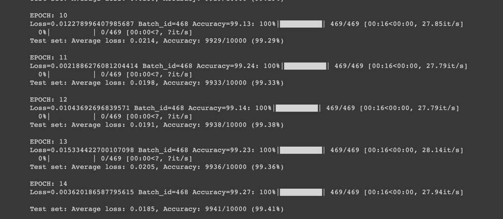

# Session 5 Assignment - Step 4

### Constraints:
- Achieve 99.4% validation accuracy
- Less than 10k Parameters
- Less than 15 Epochs

## Network

- Network Params

  
## Epochs 1-9

## Epochs 11-15

## Target:

1.   Addition of Image Augmentation (Random Rotation).
2.   Addition of GAP (Global Average Pooling) layer to the network.
3.   Addition of scheduler.

## Results:

1.   Parameters: 8,016
2.   Best Training Accuracy: 99.27
3.   Best Test Accuracy: 99.41%

## Conclusion 

*   Model is not over-fitting
*   Less than 10k params used.
*   Accuracy rising gradually and we observe 99.4% accuracy

