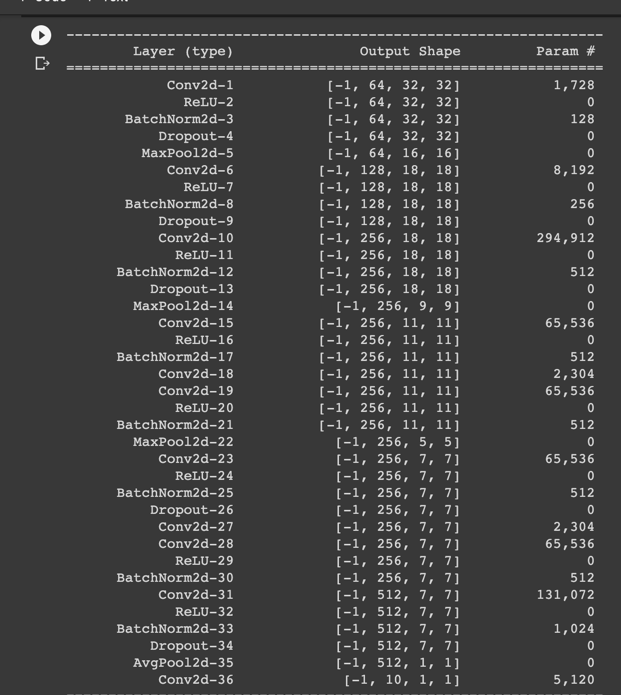

# Session 7 [Assignment](Session_7_Assignment.ipynb)

### Constraints:

- Change the code such that it uses GPU
- Total RF must be more than 44
- One of the layers must use Depth-wise Separable Convolution
- One of the layers must use Dilated Convolution
- Use GAP (compulsory):- add Fully Connected Layers after Global Average Pooling to target #of classes (optional)
- Achieve 80% accuracy, as many epochs as you want. Total Params to be less than 1M.

## Network [File](model.py)

## Network Params
  
  

## Conclusion

- Total Epochs : 40
- We reach 80% accuracy at Epoch 9, and many other times henceforth.